# 🏥 Hospital Record Management System

A Flutter-based **Hospital Record Management System** developed to simplify hospital administration by managing patients, doctors, appointments, and billing records. The application uses **SQLite** for local data storage and supports **professional PDF bill generation**.

---

## 📌 Project Overview

This application enables hospitals or clinics to efficiently manage their daily operations through a clean and user-friendly interface. It provides dedicated modules for patient management, doctor management, appointment scheduling, and billing, all stored locally using SQLite.

---

## ✨ Features

### 🔐 Login Module
- Secure Login Screen
- Responsive User Interface

### 👨‍⚕️ Patient Management
- Add Patient
- View Patient Records
- Search Patients
- Edit Patient Details
- Delete Patient Records

### 🩺 Doctor Management
- Add Doctor
- View Doctor Records
- Search Doctors
- Edit Doctor Details
- Delete Doctor Records

### 📅 Appointment Management
- Book Appointments
- View Appointments
- Search Appointments
- Delete Appointments

### 💰 Billing Management
- Generate Bills
- Automatic Total Amount Calculation
- View Bills
- Search Bills
- Delete Bills
- Professional PDF Bill Generation

---

## 🛠️ Technologies Used

- Flutter
- Dart
- SQLite (sqflite)
- PDF Package
- Printing Package
- Material Design

---

## 📱 Application Screenshots

### 🔐 Login Screen
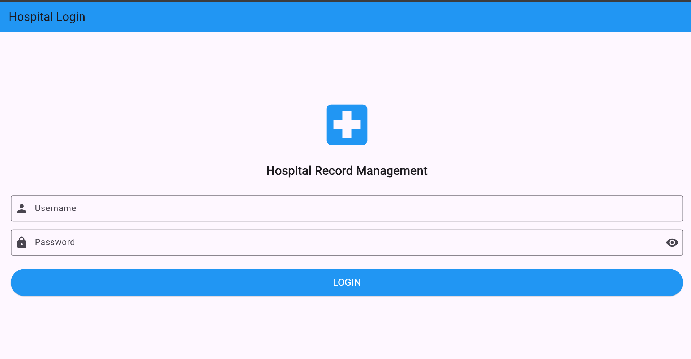

---

### 🏠 Dashboard
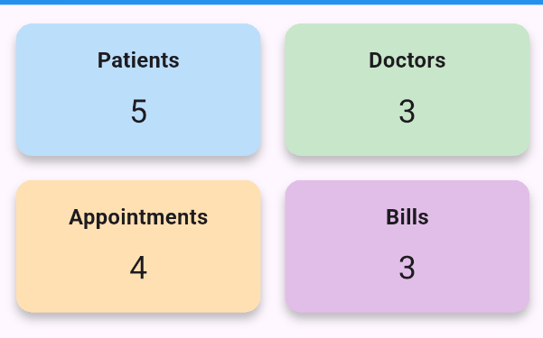

---

### 👨‍⚕️ Add Patient
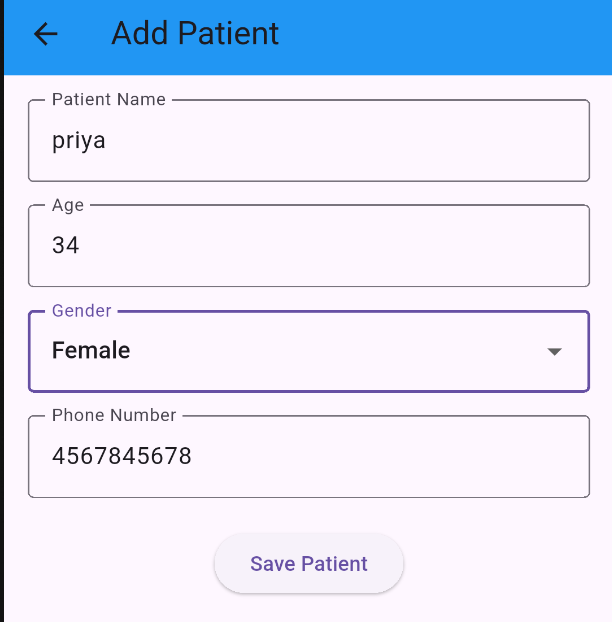

---

### 📋 View Patients
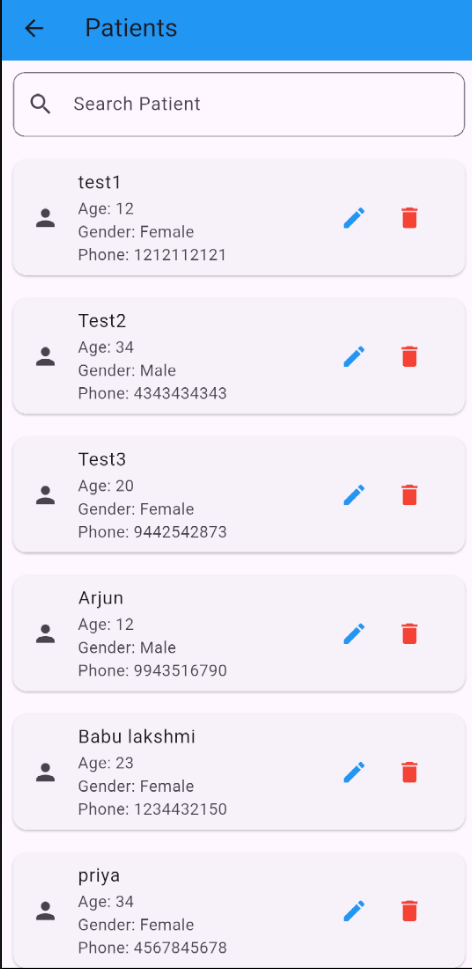

---

### 🩺 Add Doctor
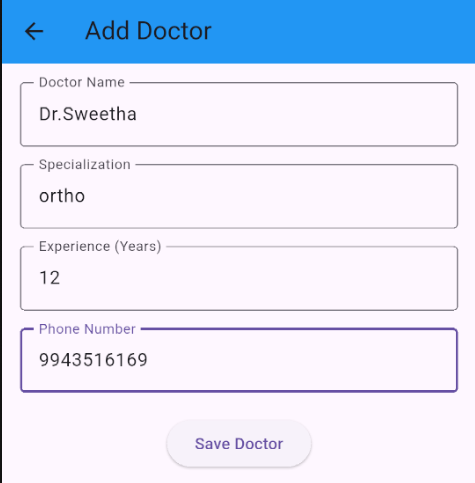

---

### 👨‍⚕️ View Doctors
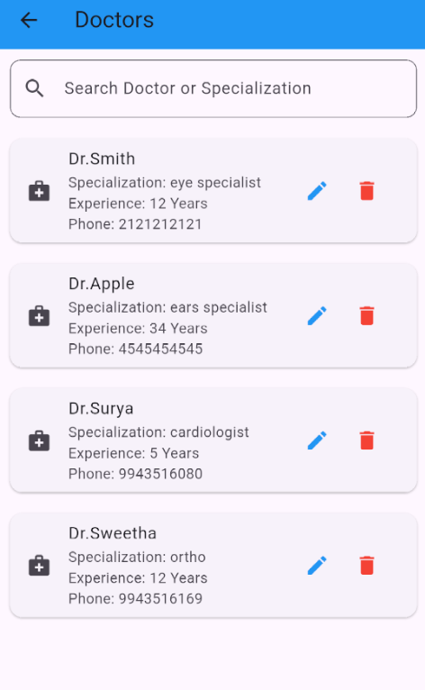

---

### 📅 Book Appointment
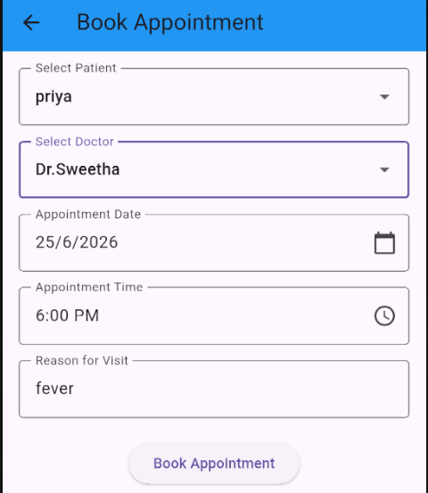

---

### 📋 View Appointments
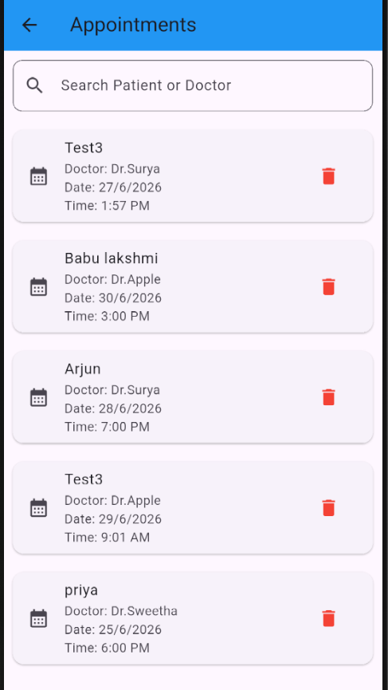

---

### 💰 Generate Bill
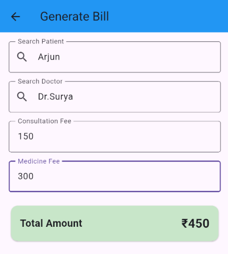

---

### 🧾 View Bills
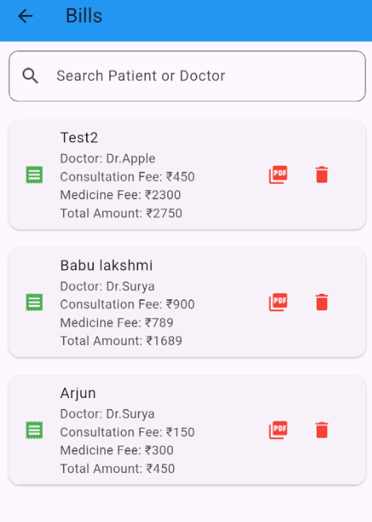

---

### 📄 PDF Bill
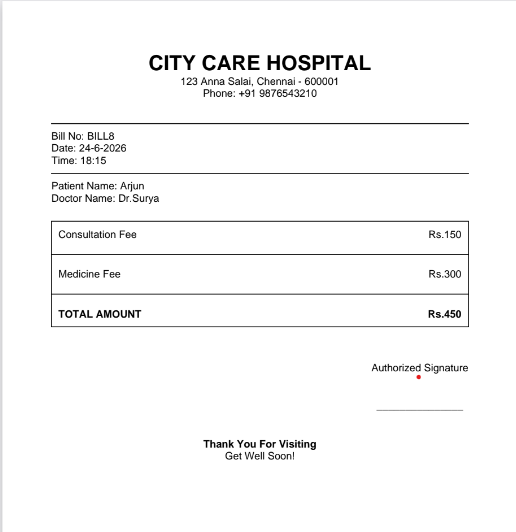

---

## 📂 Project Structure

```text
lib/
├── add_patient_screen.dart
├── view_patients_screen.dart
├── add_doctor_screen.dart
├── view_doctors_screen.dart
├── add_appointment_screen.dart
├── view_appointments_screen.dart
├── add_bill_screen.dart
├── view_bills_screen.dart
├── database_helper.dart
├── patient.dart
├── doctor.dart
├── appointment.dart
├── bill.dart
├── login_screen.dart
└── main.dart
```

---

## 🚀 Getting Started

### Clone the repository

```bash
git clone https://github.com/Sweetha-56/hospital-record-management-flutter.git
```

### Navigate to the project

```bash
cd hospital-record-management-flutter
```

### Install dependencies

```bash
flutter pub get
```

### Run the application

```bash
flutter run
```

---

## 🎯 Future Enhancements

- User Authentication with Firebase
- Cloud Database Integration
- Patient Medical History
- Doctor Availability Scheduling
- Online Appointment Booking
- Hospital Reports & Analytics Dashboard
- Email & SMS Notifications
- Dark Mode Support

---

